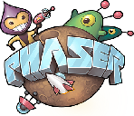
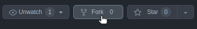

### The open source 2D shooter fighting game

[](https://app.netlify.com/sites/sdn-mech-game/deploys)

[Play Farzone](https://farzone.saricden.com)

Welcome to Farzone: the open source 2D shooter fighting game. The goal for this game is to provide players with a super fun free to play game, and provide developers assets and insights into how to develop advanced HTML5 games of their own.

## Technologies Used

[](https://en.wikipedia.org/wiki/HTML5)&nbsp;&nbsp;&nbsp;
[](https://en.wikipedia.org/wiki/CSS)&nbsp;&nbsp;&nbsp;
[](https://en.wikipedia.org/wiki/JavaScript)&nbsp;&nbsp;&nbsp;
[](http://phaser.io/)

## Running Locally

In order to run this game locally, follow these instructions:

1. [Fork](https://github.com/saricden/farzone/fork) the repository to your GitHub account.

[](https://github.com/saricden/farzone/fork)

2. Clone your repository locally.
```
git clone git@github.com:your_username/farzone.git
```
Replacing "your_username" with your own username.

3. Switch to an older version of Node.js (I use version 14).
```
nvm install 14
# or...
nvm use 14
```
If you don't have `nvm` (Node Version Manager) installed, check out [their GitHub page](https://github.com/nvm-sh/nvm).
> This is likely a temporary measure, as I will fix up the game's build tools to work with the latest version of Node.js in the future.

4. Install dependencies via `npm`.
```
npm install
```

5. Start your local development server.
```
npm run start
```

6. Navigate to `http://localhost:8080` in your browser.